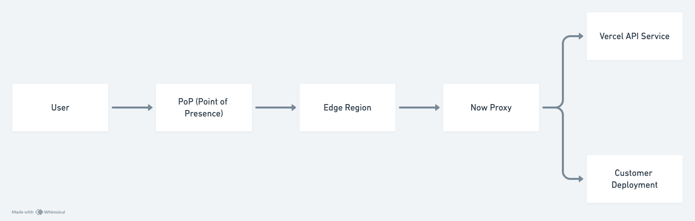

Growing is hard. It's not just getting to the growth that's difficult but also being in it. You want to present yourself as knowing all the answers and capable of responsibility when in reality, you don't know the first thing about what you're doing. But that's natural. The only way to grow is to simply _do more_.

## Company

This summer I interned at [Vercel](https://vercel.com/), a company building a cloud for web development. The idea is that they offer all the infrastructure you'll need to build a website so you can focus on work that directly impacts on your users.

One of the first moments at Vercel that stuck with me is when I presented my project at RWC “Response with Comments,” an organized meeting to reply to RFCs. I was a bit nervous, which was probably visible, but I managed to get through the whole presentation. As I finished and the floor opened up to feedback, I noticed our CTO was one of the people talking! This had the opposite effect on me than you would think. I realized that all these people were engineers, not judges, here to help bring the project to fruition, not tear it down. The same team energy that pervades Vercel is so strong that no one is too self-important to not be involved. And that is how Vercel operates, there is a strong bias towards action. If you want to do something, chances are the stakeholders will let you do it. Acting under the assumption that blockers will be resolved translates into a lot of initial momentum, allowing projects to move quickly past the incubation phase into implementation.

I don't want to give you the idea that Vercel is this efficient machine maximizing its outputs though. Vercel isn't a machine, nor would I call it well-oiled. Its processes have not yet been crafted to perfection. Things will go wrong and it may get to you. This will continue to be a point of discomfort as it continues to grow. But what's lacking in machinery is supplanted 10x by an crystal-clear mission to _build awesome experiences_. And people are aligned on this! I remember joining a meeting thinking our CEO was just going to drone on about business concerns but was extremely surprised to find him in the middle of a deep-dive into a customer's website. He jumped around a few pages, pointing out how these experiences could be improved for users, not only related to Vercel features but also just basic web features that had nothing to do with us. Vercel is a unique company in this regard that customers and the company are very closely aligned on what benefits them. All throughout the company, up and down the chain, you will find people working with customers, not just with their Vercel-related issues but also actively finding ways to improve their UX. That's how powerful this directive is.

Part of what makes an internship so interesting is that it's an ephemeral experience. It's a rare instance of people who will have very short roles at the company. Interns being able to make even a slight impact means your culture assimilates quickly (read in a non-Borg way). Vercel is a special place in this aspect. You sort of just get swept up in the action and get indoctrinated into the cult of shipping. We only have a few months to catch up on the company structure, codebase, and processes; yet I had insight into almost everything happening and the privilege of working on a project that affected almost everything.

## Project

Before I start talking about the project, I really want to give a special thanks to my mentor [Matthew Binshtok](https://x.com/abeanstalker) for all the energy and time he poured into the project alongside me. None of this would have shipped without him.

I interned on the Core Platform team and honestly I wasn't exactly sure what the goal of the team was. I think it mostly boils down to creating reliable patterns that can be used across the organization, typically involving more infrastructure level tasks. This is exactly the sort of unique experience I wanted out of this internship. I had not touched this side of engineering yet and Vercel's infrastructure is still fairly new enough that you can actually make sweeping changes in a short amount of time.

Every request to Vercel is received by the [Edge Network](https://vercel.com/docs/edge-network/overview), a globally distributed system which ensures fast response times by operating close to users. This includes both customer deployments and the Vercel API. The problem with that is tightly coupling unrelated software components greatly complicates the development process. An update to one necessitates an update to all, whether there's actually a dependency or not. I was tasked with the ambitious goal of decoupling deployment routing logic from internal API routing logic to decrease the amount of programs you have to touch to add/remove/change an API service. Here's an overview of the system:

Every request hits the reverse proxy “Now Proxy.” It determines what deployment a request corresponds to or, if it's for `vercel.com/api/*`, what backend API service it corresponds to.

The goal was to get it to look like this:

Why? “API Proxy” is a completely separate reverse proxy service, which means updates to API routing logic can be isolated to it. There's no need to even touch Now Proxy under this setup, enabling several benefits:

1. PRs can be isolated to one repository. Vercel has a monorepo for all its API services, so they could be managed in one place with API Proxy living alongside them. This would reduce a lot of the unnecessary hoops that you have to jump through to deploy a new service.
2. Deploys could happen much more quickly. Since Now Proxy is an extremely critical service we heavily supervise those rollouts. This is part of the issue we had with the tight coupling. For API Proxy we decided that a PR review was enough scrutiny.
3. The configuration for API Proxy can be generated since it is in the same repository as the API services. Since there are many steps to creating a new service and that number will only increase over time, any step getting removed from the process helps. I didn't have time to fully implement this but it's a natural next step.

I decided to use NGINX for API Proxy since it's fast, reliable, and we had already been using it. The configuration was pretty simple after all, just mapping request paths to their relative backend services. Turns out there's nothing simple about building a reverse proxy that processes thousands of requests per second and supports 80+ API services with varying requirements. Who would have thought?

The switch to API Proxy had to be incremental, and there was no room for negotiation here. This may seem obvious but it's somewhat surprising how much time is spent on this if you're new to working at this scale. Even though it made the project more difficult, it was necessary, we could not afford any downtime due to bugs. What this usually translates into is rolling changes out behind feature flags and opting in only certain users or requests. For this project, I chose to randomly opt in requests so any issues that arose would not have a significant impact on any particular user. Vercel's internal feature flag infrastructure also allows configuring flags per-region which helped to validate code in production before affecting a large number of users.

As I began to write code and put PRs up, I found it difficult to get my code reviewed or just talk about any obstacles I had hit. Of course my mentor smoothened some of this out, but, when there's more than a few engineers at a company, you'll inevitably need something from another team. This was a new experience for me, as I had never run into obstacles in the reviewing or collaborating process before. I found out that who you know and who knows you matters. You won't necessarily be locked out if you don't know the right people, but effective communication will help get things done much faster. If you need someone's help then seek them out! They certainly won't just come to you. Being shy gets you nowhere.

With that out of the way, I moved on to thinking about how API Proxy should actually be deployed - a beast of its own. Thankfully, API Proxy shared a requirement with almost every service: it needed to scale up and down in response to changes in request traffic. The established pattern for this in Vercel is deploying to Kubernetes clusters located in every edge region. Unfortunately my knowledge of Kubernetes stopped at its name, Kubernetes. Well, there's no better way to learn something than to dive right into it. My mentor took me on an extensive walkthrough of how it works and I can safely say I understood about 5% of it, but it was a good introduction nonetheless. I got familiar with terms like “nodes,” “pods,” and “deployments,” and “HPAs.” I also have to say my knowledge of Docker really helped me get by here, otherwise creating container images for API Proxy would have been an ordeal of its own.

The Kubernetes configuration I landed on was using an HPA (Horizontal Pod Autoscaler) to automatically update the number of replicas based on the average CPU utilization. Some regions get more traffic than others, and so they should also scale to have more pods than others. We point the HPA at a Deployment with a container running an image of the NGINX proxy. This allows us to do a “rolling update” where, on updating the container image, we replace a few pods at a time to avoid complete downtime during rollouts. Full disclosure, I didn't have to come up with this pattern myself because Vercel was already doing this for their other services. But it worked very well!

I also did some optimization work to minimize the overhead of adding a new service in the Vercel API hot path. Since API Proxy would be handling a lot of traffic from Now Proxy, it didn't make sense to open and close a connection for each request which would result in increased latency. That's where connection pooling comes in: the downstream service (Now Proxy) can establish some longer-lived connections to the upstream (API Proxy) with the goal of minimizing the number of connections it has to maintain. NGINX has [this feature built-in](https://nginx.org/en/docs/http/ngx_http_upstream_module.html#keepalive) so it was just a matter of enabling a few more options (another reason to use NGINX - many use cases have been covered already!).

There's a surprising amount of documentation involved in each and every service that goes out. From RFCs to runbooks to the handoff I wrote at the end of my internship, I wrote _a lot_. What doesn't usually get talked about though is keeping up a stream of public but personal documentation. I only realized how necessary this was after I had not done it and burned some time. It serves as a reference for yourself so you avoid “cold starts” where you have to re-think about problems you already worked out. I think this is relevant to company scale because your brain crowds much faster when there's more code to parse. It's also a good way to keep people informed and involved. Making stakeholders aware of decisions _before_ you start working on them can save time from going down the wrong path. Unfortunately I had to experience that firsthand multiple times before addressing the root cause.

As the project approached rollout, another problem reared its ugly head and stomped it back down into the ground. That problem's name was Observability. Observability is usually something you don't think about at all in a personal project or an early-stage startup. Whatever happens, happens, and it's not a big deal whether you saw it or not. For this reason I had not thought much about it until right before it was ready to deploy. I had to implement two types of observability, one for insight into every piece of information about a given request (1% sampled) and another for the numbers relating to the service (requests/second, connections, latency, etc.). The first one could be used to extrapolate patterns, for example if there was a spike in 5xx status codes, and the second one could be used to infer general service health. Luckily they didn't prove difficult to add on, but I learned it's probably best to think about it while architecting a system rather than after.

Finally getting to deploy API Proxy felt amazing. However, I was badly mistaken in thinking that everything would move rapidly after I reached this phase. It turned out to be a rollercoaster. After enabling the feature flag in a few regions, we hit our first incident, but it was a dud and we shortly ramped back up. The second one was a bit more of a scare relating to memory leaks. The third incident manifested later on and was more drastic in its impact. In the last one, API Proxy broke the domains WebSocket service for a couple hours (curse you [hop-by-hop headers](https://datatracker.ietf.org/doc/html/rfc2616#section-13.5.1)!). Surprisingly, none of these turned out to be a big deal at all. An overview of the two more interesting incidents is below.

### _The Second Incident_

I woke up one morning and checked the service's logs only to find there were _none_ in one of our regions, so we were either serving zero requests in that region or dropping logs. The latter seemed more likely. At the same time the monitor for the memory usage of each pod showed the memory steadily increasing for a few hours before flatlining at the [memory limit](https://kubernetes.io/docs/concepts/configuration/manage-resources-containers/). Concerned it was a memory leak, my mentor and I investigated immediately and believed it was related to our log files. To prevent the NGINX access log from growing infinitely we were [rotating logs](https://en.wikipedia.org/wiki/Log_rotation#:~:text=In%20information%20technology%2C%20log%20rotation,metrics%20that%20can%20apply%20here) once they reached 1 GB. We thought this might be the cause because our memory limit was set to 512 MB, but lowering the maximum log file size didn't fix it. That sort of led us astray but we also noticed NGINX also wasn't properly [re-opening log files](https://nginx.org/en/docs/control.html#logs) after rotation and continued writing to the old one. But alas, it couldn't be that easy either. Finally we arrived at the epic conclusion that there was no memory leak in the first place. We had wondered from the beginning why the pods hovered at the memory limit instead of going over and getting killed. In [this GitHub issue](https://github.com/kubernetes/kubernetes/issues/43916) we found out that Kubernetes was actually including the page cache in the calculation for memory limits. The page cache was steadily growing because we were opening multiple log files and writing to them. Thus, the memory flatlined after because as the pod hit the memory limit, it evicted page cache entries to make space for the more essential work being done.

### _The Third Incident_

NGINX is declarative, making it extremely difficult to determine the order of operations. For most use cases that's fine, but for Vercel we use a ton of directives and the order they are executed matters. In one such case we [`rewrite`](https://nginx.org/en/docs/http/ngx_http_rewrite_module.html#rewrite) request paths in Now Proxy before sending them to be handled by a particular backend service. For example, if we received a `/api/my-service/:id` request, we might rewrite the URL to `/:id` before sending it to `my-service` for processing. However we also `rewrite` requests in Now Proxy to be sent to API Proxy instead, depending on whether the feature flag is enabled or not. Because NGINX was rewriting the URL for the service before it was rewriting to API Proxy, API Proxy ended up seeing the requests as just `/:id` with no indication of what service that request was for, resulting in errors for a few services. I noticed pretty quickly because of the observability I added and pulled the rollout before it affected too many users. It took me days of investigation and even an re-rollout with an attempted fix before I found the actual bug. Lesson learned, never trust that declarative systems will do what you think they will.

I was initially demoralized when all these incidents happened. I wish I could tell you that I got over it and didn't let it affect me but I did. It's hard to see something you spent so much energy on be set back. I spent hours upon hours painstakingly pouring over monitors to make sure it was all going smoothly and over weeks watching the numbers tick up slowly from 30 to 300 to 3,000 requests/second. Obsessing doesn't help though and it's not healthy. I'm still figuring this out how to deal with it. One approach that my mentor gave me is to keep these things in context when they happen - you can't cause such incidents unless you're making a meaningful impact.

As the end neared it was unclear which would come first - the end of my internship or the completion of the project. This caused me a good deal of unwarranted stress. Up until this point, I had still succeeded in doing so much. I struggled with recognizing that and have much to improve here. It's ultimately more sustainable to be satisfied with yourself than depend on the erratic satisfaction of others in your work. With a lot of encouragement though, I kept going, squashing all the bugs that came up and pushing onward. Suddenly at the end we accelerated our efforts and delivered the project at 100% rollout just in time.

## Reflection

Oddly, I felt relieved more than anything upon succeeding. I was leaving having made a sizable impact and achieving what I set out to do: explore a new area of tech and push myself. The thing about that though is it's difficult to overcome your own biases about yourself. I am someone who underestimates my own capability. But never in my life have I been believed in more than the 3 months I spent as an intern at Vercel. You may think I'm exaggerating this point, but I'm not. Where else will you find the opportunity to deploy a new service handling millions of requests a day? I was trusted simply because people believed in _me_ and, even though I didn't know it, I am capable of so much more.
